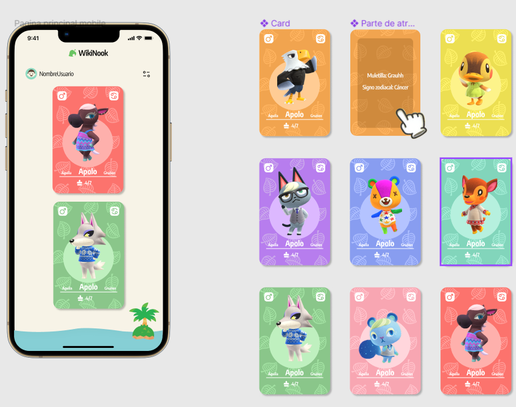

# Dataverse

## Índice

* [1. Introducción](#1-introducción)
* [2. Descripción del proyecto](#2-Descripción del proyecto)
* [3. Funcionalidades](#3-funcionalidades)
* [4. Historia de usuario](#4-Historia de usuario)
* [5.Tecnologías utilizadas](#5-Tecnologías utilizadas)
* [6. Prototipo de alta y media fidelidad](#6-Prototipo de alta y media fidelidad)
* [7. Objetivos de aprendizaje](#7-objetivos-de-aprendizaje)

***

## 1. Introducción
Bienvenido a data Dataverse, la página donde encontraras información de personajes del video juego animal crossin en forma de tarjetas.

## 2. Descripción del proyecto.
Dataverse es un proyecto para la diversión del público en general, es una página que tiene un estilo adaptable, para laptop, tablet y celular, en el que podras encontrar las tarjetas de tu personaje favorito, pero no solo eso, puedes hacer una búsqueda por nombre de tu personaje favorito, también puedes filtrar las tarjetas por orden, especie, etc.

## 3. Funcionalidades

* Cuenta con una barra de búsqueda y esta contiene un botón de limpiar.
* tiene un espacio que te permite filtrar por especie, personalidad y género.
* Tiene un botón que permite organizar las tarjetas en orden ascendente y descendente.
* Tiene un botón que te permite borrar todos los filtros antes seleccionados.
* Tiene un botón que te permite ver la estadistica encuanto a personajes por su género.

## 4. Historias de ususario

Aquí contamos con un documento que nos permite conocer los pasos en los que se desarrollo el proyecto
[Enlace del documento](https://docs.google.com/document/d/1K8NoQyA83kZ_FGCIBDcJ6XyT0XXSpx40iVrrJk-1XwY/edit)

## 5. Tecnologías utilizadas

### Prompt utilizado
Se utiliza chatGPT como IA requerida, este nos facilito la extración de información que requeriamos para las tarjetas.

### `/index.html`

En este apartado encontraras la estructura de la página.

### `/main.js`

Aqui se realiza el llamado del DOM que nos permite la interacción con el mouse

### `/dataFunctions.js`

Este apartado cuenta con tres funciones que nos permiten realizar la parte dinamica de la página
### `/data`

Aquí se puden encontrar los datos generados con ayuda de la IA

### `test/dataFunctions.spec.js`

Aquí se realizaron test de prueba unitaria que nos ayudan con el buen funcionamiento de las tres funciones realizadas

### `test/data.js`

Este archivo no ayuda en la prueba de los test realizados en el archivo dataFunction.spec.js

### `src/view.js`

En este archivo se relizaron la estructura de las tarjetas mostradas en el THML

## 6. Prototipo de alta y media fidelidad

#### Testeos de usabilidad
  